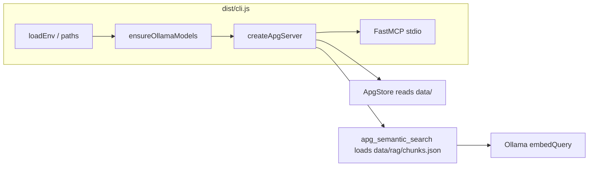

# Architecture

## High-level flow

1. **`cli.ts`** is the process entry (`package.json` → `bin` → `dist/cli.js`).
2. **`resolveDataDir()`** (in `paths.ts`) loads **`.env`** and resolves the directory containing **`manifest.json`** (usually `data/` next to `dist/`).
3. **`ensureOllamaModels()`** calls Ollama **`/api/tags`** and **`/api/pull`** so chat and embedding models exist (unless `OLLAMA_SKIP_PULL` is set). Logs go to **stderr** so **stdout** stays clean for MCP JSON-RPC.
4. **`createApgServer(dataDir)`** builds a **FastMCP** instance: tools, resources, and optional RAG search.

## Source layout (`src/`)

| Module                    | Role                                                      |
| ------------------------- | --------------------------------------------------------- |
| `cli.ts`                  | Entry: ensure models → resolve data dir → start MCP stdio |
| `create-server.ts`        | Registers MCP tools and resources on `FastMCP`            |
| `apg-store.ts`            | Reads `manifest.json`, pattern Markdown, example bundles  |
| `paths.ts`                | `loadEnv()`, `resolveDataDir()`                           |
| `config/load-env.ts`      | Loads `.env` from package root                            |
| `config/ollama.ts`        | `getOllamaConfig()` — Zod-validated Ollama-related env    |
| `ollama/langchain.ts`     | `createChatOllama()`, `createOllamaEmbeddings()`          |
| `ollama/ensure-models.ts` | HTTP pull/tag helpers for Ollama                          |
| `rag/`                    | Chunking, cosine search, `loadRagIndex` / `writeRagIndex` |
| `manifest-types.ts`       | Shared types for manifest and JSON bundles                |

## Scripts (`scripts/`)

| Script            | Purpose                                                                                         |
| ----------------- | ----------------------------------------------------------------------------------------------- |
| `ingest.ts`       | Clone `w3c/aria-practices`, write `data/manifest.json`, `data/patterns/*.md`, `data/bundles/**` |
| `index-rag.ts`    | Build `data/rag/chunks.json` using Ollama embeddings                                            |
| `ollama-smoke.ts` | Minimal `ChatOllama` call to verify connectivity                                                |

## Build

- **`tsc`** compiles `src/` → `dist/` (see `tsconfig.json`).
- **`npm pack`** / publish includes **`dist`** and **`data`** per `package.json` `files` (RAG index under `data/rag/` is gitignored but can exist locally after `rag:index`).

## Public API (`src/index.ts`)

Re-exports the MCP factory, `ApgStore`, path/env helpers, Ollama factories, `ensureOllamaModels`, and RAG utilities for consumers who embed the library.
